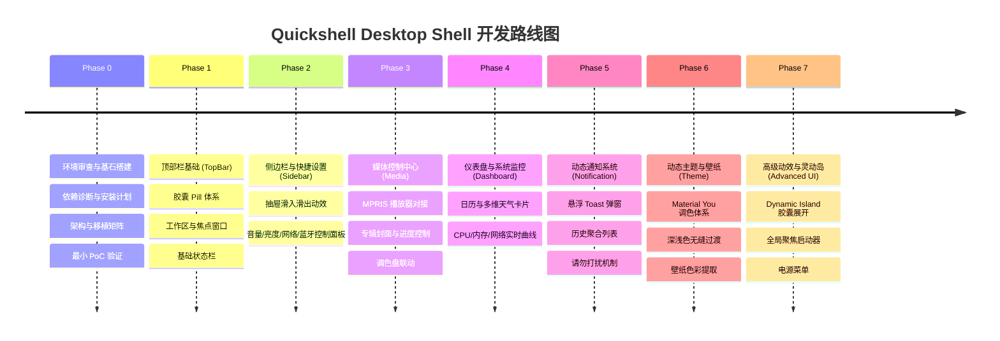

# 阶段演进路线图 (ROADMAP.md)

本项目采取分阶段推进、严密验证的迭代开发模式。在每个阶段，必须确保后端服务、数据模型与前端 UI 的解耦与稳定性，严禁直接堆砌未经验证的复杂代码。

---

## 阶段演进总览

---

## 详细阶段计划

### Phase 0 — 环境审查、架构确立与最小 PoC (已完成)
- [x] Ubuntu 24.04 LTS (GNOME 46 + Wayland) 本机环境诊断与记录
- [x] Quickshell / Qt 6 依赖状态确认
- [x] 参考项目 `StatIndet/quickshell` 深度源码剖析
- [x] 输出 `docs/PORTABILITY_MATRIX.md` (可移植性矩阵)
- [x] 输出 `docs/ARCHITECTURE.md` (架构规范与分层设计)
- [x] 确立本项目目录规范与 Git 版本库初始化
- [x] **实施验证**：通过独立 Nix Flakes 环境建立无污染、可复现的 Quickshell 运行时
- [x] **实施验证**：启动最小 FloatingWindow PoC 并成功在当前 GNOME 46 Wayland 会话中渲染呈现

---

### Phase 1 — Shell 基础 (TopBar 核心系统 - 进行中)
**目标**：在屏幕顶部呈现出稳定、美观的 Matugen Sage & Mint 毛玻璃风格胶囊状态栏。
- [x] 基础视觉体系落地：`Colors.qml`, `Sizes.qml`, `Animations.qml`, `Typography.qml`, `Theme.qml` (完全对齐 Clavis 参考质感与毛玻璃规范)
- [x] 核心胶囊组件封装：`Pill.qml` (带环境阴影与微光玻璃边缘), `ClockPill.qml`, `WorkspacePill.qml`, `StatusPill.qml`
- [x] 顶层容器抽象：`TopBarWindow.qml` (基于 FloatingWindow 的无边框兼容适配器)
- [ ] TopBar 布局精细化：左侧工作区/品牌、中央悬浮时钟、右侧状态组的屏幕顶部定位与多屏幕适配
- [ ] 真实系统数据接入初版 (逐步替代 mock)：
  - 基础系统时间/时区/本地化完善
  - 真实工作区联动 (GNOME D-Bus / EWMH)
  - 系统监控指标 (Linux /proc 原生采集)

---

### Phase 2 — 侧边栏与快捷设置 (Sidebar & QuickSettings)
**目标**：可平滑拉出的功能抽屉，提供完整的日常硬件与系统快捷配置。
- 抽屉容器与贝塞尔曲线平滑进出动效 (`SidebarHostWindow`)
- 快捷开关网格：Wi-Fi、蓝牙、勿扰模式、夜间模式
- 交互滑块：系统输出音量、麦克风输入音量、屏幕背光亮度
- 网络子面板：扫描并显示可用 Wi-Fi 列表与连接状态
- 蓝牙子面板：已配对设备与附近蓝牙设备发现

---

### Phase 3 — 媒体控制中心 (Media Player Integration)
**目标**：高保真媒体展示卡片，与音乐/视频播放器实时同步。
- `MediaService` 深度集成 `Quickshell.Services.Mpris`
- 播放控制：播放/暂停、上一曲、下一曲、拖拽进度条定位
- 元数据解析：曲名、艺术家、专辑名、高清封面异步载入
- 状态栏 Mini 媒体小胶囊与展开大卡片自适应切换

---

### Phase 4 — 仪表盘与天气 (Dashboard & System Monitor)
**目标**：信息丰富、排版克制的综合信息中枢。
- 日历与待办事项聚合卡片
- 天气服务 (`WeatherService`)：基于 Open-Meteo 实时气象数据，包含温度、风速、空气质量与多日预报趋势图
- 系统资源监控 (`SystemMonitorService`)：
  - 直接读取 Linux `/proc/stat` 与 `/proc/meminfo`
  - CPU 综合占用率与多核曲线
  - 物理内存与 Swap 使用占比
  - 实时网络上行与下行速率动态图表

---

### Phase 5 — 动态通知中心 (Notification Center)
**目标**：非侵入式、信息层级清晰的通知处理中心。
- 屏幕右上角平滑滑入的 Toast 临时弹窗，超时自动消失
- 侧边栏通知历史持久化记录与应用归类分组
- 操作按钮联动（如“回复”、“标记已读”）
- “请勿打扰”状态联动与通知静音逻辑

---

### Phase 6 — 个性化设置中心与动态主题 (Settings & Personalization)
**目标**：提供如同参考截图中居中展示的 Settings 面板，让用户自由定制壁纸、显示效果与主题风格。
- **Settings 控制中心界面**：
  - 壁纸选择与实时预览 (Wallpaper Selector & Live Preview)
  - 界面半透明度与毛玻璃模糊度动态微调 (Translucency / Glass Blur Level)
  - 顶栏布局方式与胶囊显隐定制 (TopBar Layout Customization)
- **动态色彩联动**：
  - 集成 Matugen 算法，依据用户选中的壁纸自动提取 Sage & Mint 等和谐调色板
  - 深色 (Dark) / 浅色 (Light) 模式一键平滑渐变切换
  - 允许用户手动覆盖主色调 (Primary / Accent) 与高光强度

---

### Phase 7 — 灵动交互与高级特质 (Advanced UI & Polish)
**目标**：打造充满生机与现代感的交互细节。
- **Dynamic Island (灵动岛)**：居中状态指示器，根据音量变化、媒体切歌、通知到来时动态舒展/收缩
- **Spotlight 聚焦启动器**：支持应用快速搜索启动、计算器小工具与文件快速索引
- **现代化 PowerMenu**：优雅的全屏虚化锁屏、注销、休眠、重启与关机确认界面
- 性能深度调优：GPU 离屏渲染优化、空闲时零 CPU 唤醒优化
